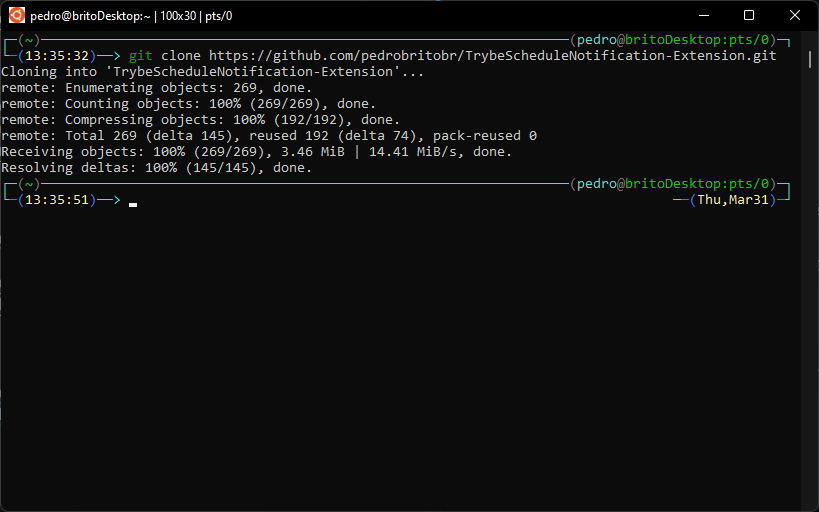
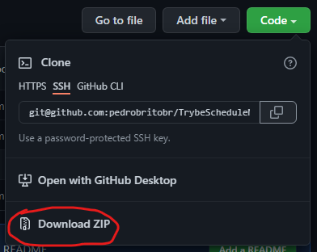
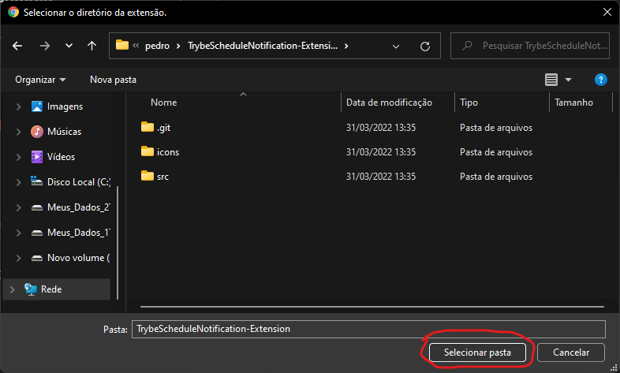
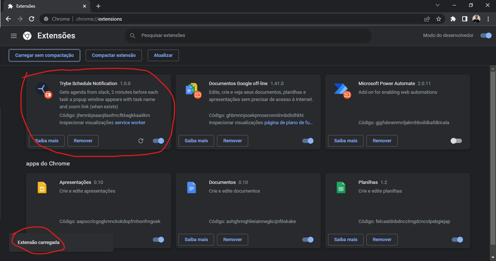

# Trybe Schedule Notification

Extensão para [navegadores base chromium](https://en.m.wikipedia.org/wiki/Chromium_(web_browser) "Chromium Wikipédia") para facilitar o dia a dia do estudante da [Trybe](https://github.com/betrybe "github.com/betrybe").

## Sumário
- [Instalação](#instalação)
- [Uso](#uso)
- [Agradecimentos](#agradecimentos)

## <a id="instalação"></a> Instalação

> Enquanto espero a aprovação da Google para publicar a extensão na [Google Web Store](https://chrome.google.com/webstore/category/extensions?hl=pt-BR "Google Web Store") caso queira experimentar antecipadamente faça os seguintes passos:


1. Faça o clone do repositório ou o download em .zip:  
```sh
git clone git@github.com:pedrobritobr/TrybeScheduleNotification-Extension.git
```
&emsp;&emsp;
<br>
<br>
* Download em .zip:  
&emsp;
<br>
<br>

2. Acesse a página de Extensões Instaladas:  
Digite na barra de endereço/pesquisa
```
chrome://extensions
```

3. Instale a extensão  
* Ative o ***modo desenvolvedor***
* Clique em ***Carregar sem compactação***
* Navegue até a raiz da pasta que você fez o clone (Estar dentro da pasta *TrybeScheduleNotification-Extension*)
&emsp;&emsp;

* Confirme a pasta selecionada, deve aparecer uma mensagem de sucesso e a extensão

&emsp;&emsp;

## <a id="uso"></a> Uso
## <a id="agradecimentos"></a> Agradecimentos
