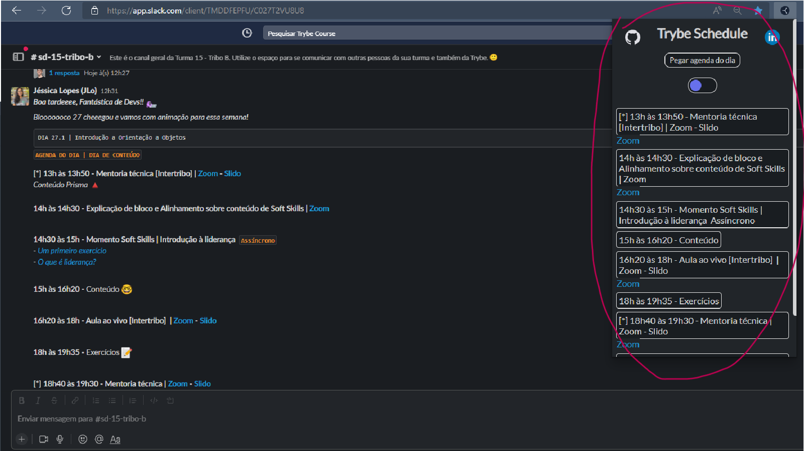
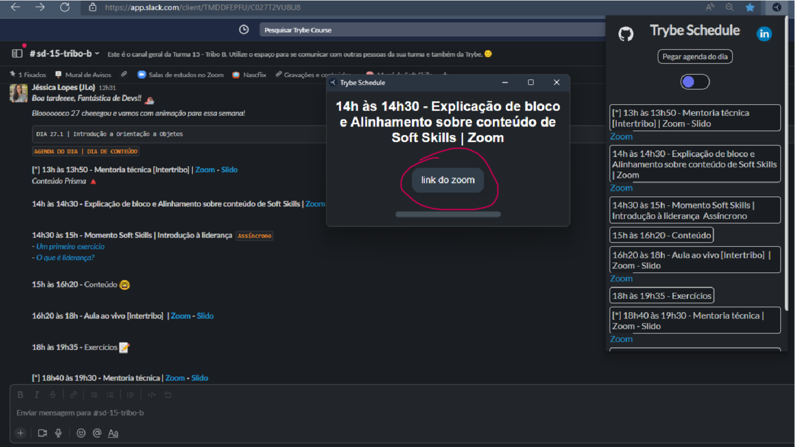

# Trybe Schedule Notification

Extensão para [navegadores base chromium](https://en.m.wikipedia.org/wiki/Chromium_(web_browser) "Chromium Wikipédia") para facilitar o dia a dia do estudante da [Trybe](https://github.com/betrybe "github.com/betrybe").

## Sumário
- [Instalação](#instalação)
- [Uso](#uso)
- [FAQ](#faq)
- [Contribuidores](#contribuidores)

___
## <a id="instalação"></a> Instalação

#### Baixe direto da [Google Web Store](https://chrome.google.com/webstore/category/extensions?hl=pt-BR "Google Web Store")
> https://chrome.google.com/webstore/detail/nhmfokgalidahgpfhichphmpckeademg

#### Ou instale manualmente e faça suas modifiçãoes 😄

1. Faça o clone do repositório ou o download em .zip:  
```sh
git clone git@github.com:pedrobritobr/TrybeScheduleNotification-Extension.git
```
&emsp;&emsp;
<br>
<br>
* Download em .zip:  
&emsp;
<br>
<br>

2. Acesse a página de Extensões Instaladas:  
Digite na barra de endereço/pesquisa
```
chrome://extensions
```

3. Instale a extensão  
* Ative o ***modo desenvolvedor***
* Clique em ***Carregar sem compactação***
* Navegue até a raiz da pasta que você fez o clone (Estar dentro da pasta *TrybeScheduleNotification-Extension*)
&emsp;&emsp;

* Confirme a pasta selecionada, deve aparecer uma mensagem de sucesso e a extensão

&emsp;&emsp;

#### :rotating_light: ***Não (re)mova a pasta raíz de lugar, senão o navegador não carregará a extensão. Tendo que reinstalar apontando para o novo caminho!***
___
## <a id="uso"></a> Uso
#### :rotating_light: ***A extensão foi feita para a versão web do slack, ela não funcionará com o app desktop***

1. Abre o site do slack e navegue até o post com os horários do dia e clique no ícone da extensão.

&emsp;&emsp;

2. Clique no botão "Pegar agenda do dia"

&emsp;&emsp;

3. Após pegar os horários do dia, será criado um alarme para evento do dia, inclusive para os eventos opcionais.

&emsp;&emsp;

4. 2 minutos antes de cada evento do dia, uma janela se abrirá com o título e o link do zoom (quando tiver)

&emsp;&emsp;

##### &emsp;* A página de alarme se fechará após 20 segundos
##### &emsp;* Por conta de cada mensagem ter um estilo diferente, pode ser que os links do zoom não apareçam, ou o link exibido não seja o link correto.
___
## <a id="faq"></a> FAQ

>P: Tem como não me notificar nos eventos opcionais?  
R: Não, mas essa feature já está em desenvolvimento, e você poderá escolher quais alarmes deverão tocar.

>P: Os links do zoom estão errados, o que fazer?   
R: Não há  oque fazer no momento, tem dias que isso pode acontecer, não se preocupe que o alerta será emitido, porém sem o link do zoom, ou com o link incorreto, então, cuidado!

>P: Dá para usar com o app desktop?  
R: Não, pois o método para pegar as informações é o web scarping, ou seja, coleta de dados de uma página web.  

>P: Preciso deixar a págino do slack aberto?  
R: Não, basta o navegador estar aberto.  

>P: O alarme não tocou, o que fazer?  
R: Me chame no slack para vermos o que aconteceu.

___
## <a id="contribuidores"></a> Contribuidores e testadores
* [Alef Sloan](https://github.com/AlefSloan)  
* [Caio Mendes](https://github.com/caioMendesCM)  
* [Denis Jonathan](https://github.com/denisjo7)  
* [Guilherme Giacomini](https://github.com/ggiacomini2012)  
* [Matheus Santos](https://github.com/matheusg18)  
* [Pedro Henrique](https://github.com/Pedro0505)  


___
Muito obrigado a todos que dedicaram seu tempo para testar e me ajudar nesse projeto!
